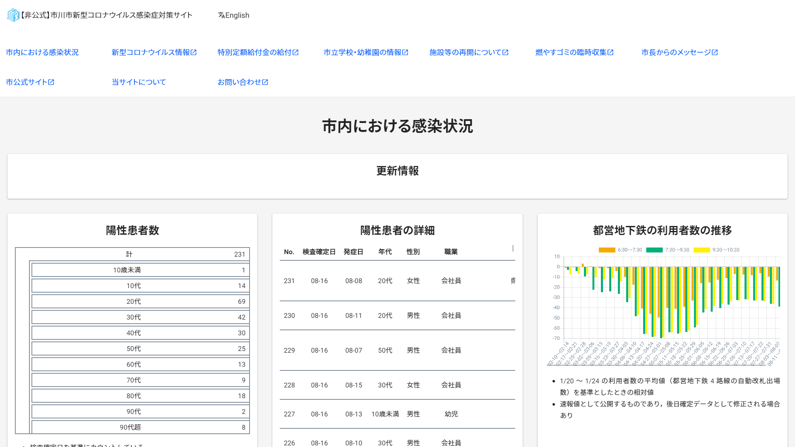
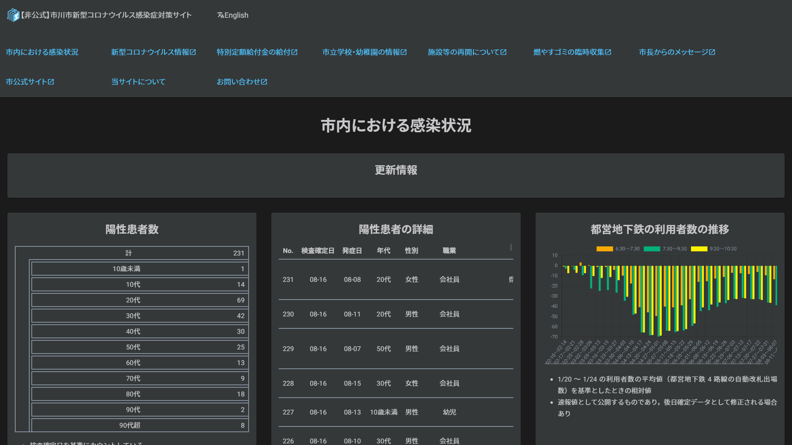

当サイトをご利用いただきありがとうございます。

本日，サイトの改修を行いました。これに伴い，一部のコンテンツに変更がございます。[詳しくは後述をご覧ください](#変更点)。

以前使用していた東京都のテンプレートは，メンテナンスが大変だと感じました。そのため，Hugo を使った独自のデザインに作り直した次第です。新しいデザインは，従来よりも軽量な設計ですので，快適にご覧いただけるかと思います。

当サイトのソースコードは GitHub 上で公開しております。データの更新，翻訳の改善など，まだまだ課題は山積しています。少しでも興味のある方は，[当サイトの GitHub レポジトリ](https://github.com/Meiryo7743/covid-19-ichikawa/)をご覧ください。

今後とも，当サイトをよろしくお願い申し上げます。

---

## 変更点

### 新機能

- ダークテーマに対応

### 廃止

- PWA
- やさしいにほんご版の対応
- `<iframe>` タグによるグラフの埋め込み

## スクリーンショット

