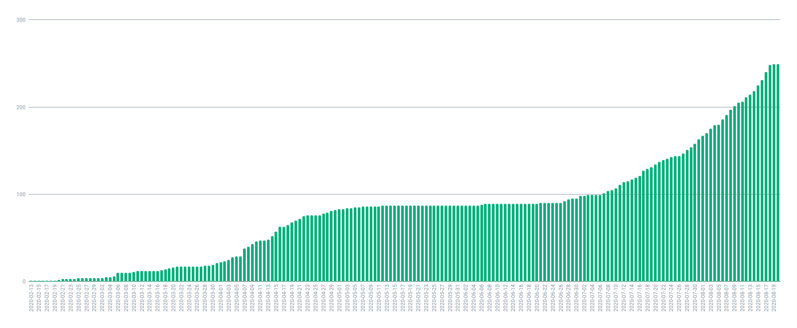

実は，当サイトを改修する際に，陽性患者数の推移を示したグラフを廃止しています。具体的には以下の図のようなグラフがありました。

\
陽性患者数の推移グラフ（[東京都のサイト](https://stopcovid19.metro.tokyo.lg.jp/)より）

このグラフは，いずれ復活させようと考えています。今現在，グラフを描画するのに必要なデータは揃っています。しかしながら，それを上図のような形で実装するためには，少しばかり時間が掛かりそうです。

とはいえど，現段階での状況をグラフにしたらどうなるか，気になる方がいらっしゃるかもしれません。そこで，今回は Google Sheets を利用して，陽性患者数の推移をグラフを作ることにしました。以下に，そのグラフを示します。なお，検査確定日を基準にカウントしています。

\
陽性患者数の推移（日別）

\
陽性患者数の推移（累計）

グラフを眺めて見ると，どうやら 4 月と 7 月以降にかけて新規感染者数が増加していることがわかります。2020 年 8 月 20 日現在，[日本は第二波の真っ只中である](https://www3.nhk.or.jp/news/html/20200819/k10012573361000.html?utm_int=nsearch_contents_search-items_001)というニュース報じられていますが，このことはグラフを見ても明らかです。とりわけ，8 月に入ってからは，わずか 3 週間の間だけで約 100 件も増加しています。

以上のことから，感染者が増加傾向にあることがわかりました。この状況がいつまで続くのか，計り知ることができないように思えます。マスクの着用，COCOA（[Android 版](https://play.google.com/store/apps/details?id=jp.go.mhlw.covid19radar)／[iPhone 版](https://apps.apple.com/jp/app/id1516764458)）をインストールしておく……など，自分自身で可能なことは何かを改めて確認する必要があるのではないでしょうか。
